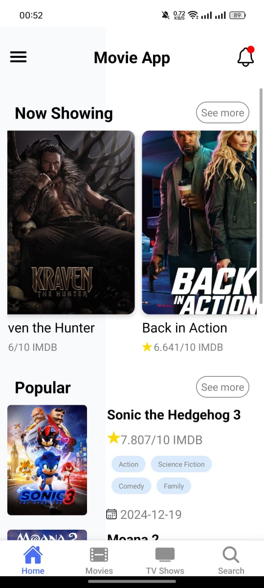

# Movie App

 <!-- Add your app logo here -->

A modern and user-friendly **React Native** mobile application for discovering movies, TV shows, and more, powered by the [TMDB API](https://www.themoviedb.org/documentation/api). Built with [Expo](https://expo.dev) for seamless development and deployment.

---

## Features

- **Discover Movies**: Browse trending, popular, and upcoming movies.
- **Search Functionality**: Search for movies, TV shows, and actors.
- **Movie Details**: View detailed information about movies, including ratings, cast, trailers, and reviews.
- **Watchlist**: Save your favorite movies to watch later.
- **Dark/Light Mode**: Supports both dark and light themes for better user experience.
- **Responsive Design**: Optimized for mobile devices.

---

## Screenshots

| Home Screen | Movies | Tv Shows |Movie Details
|-------------|---------------|----------------|----------------|
|  |  |  |  |

<!-- | Watchlist | Dark Mode | Light Mode |
|-----------|-----------|------------|
|  |  |  | -->

---

## Get Started

This is an [Expo](https://expo.dev) project created with [`create-expo-app`](https://www.npmjs.com/package/create-expo-app). Follow these steps to set up and run the app locally:

1. **Clone the repository**:
   ```bash
   git clone https://github.com/your-username/movie-app.git
   cd movie-app