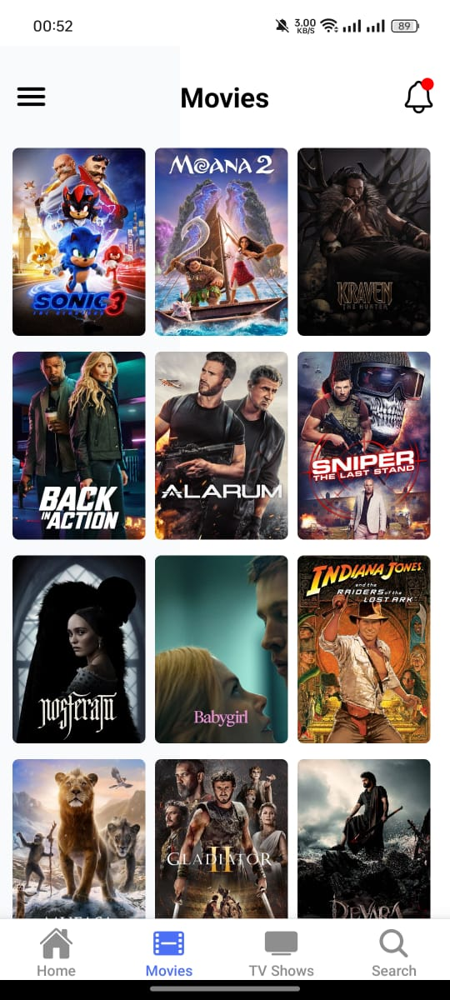

# Movie App

 <!-- Add your app logo here -->

A modern and user-friendly **React Native** mobile application for discovering movies, TV shows, and more, powered by the [TMDB API](https://www.themoviedb.org/documentation/api). Built with [Expo](https://expo.dev) for seamless development and deployment.

---

## Features

- **Discover Movies**: Browse trending, popular, and upcoming movies.
- **Search Functionality**: Search for movies, TV shows, and actors.
- **Movie Details**: View detailed information about movies, including ratings, cast, trailers, and reviews.
- **Watchlist**: Save your favorite movies to watch later.
- **Dark/Light Mode**: Supports both dark and light themes for better user experience.
- **Responsive Design**: Optimized for mobile devices.

---

## Screenshots

| Home Screen | Movies | Tv Shows |Movie Details
|-------------|---------------|----------------|----------------|
|  |  |  |  |

| search | Dark Mode |
|-----------|-----------|
|  |  |

---

## Get Started

This is an [Expo](https://expo.dev) project created with [`create-expo-app`](https://www.npmjs.com/package/create-expo-app). Follow these steps to set up and run the app locally:

1. **Clone the repository**:
   ```bash
   git clone https://github.com/reda-trouki/Movies.git
   cd movie-app
   ```

2. **Install dependencies**:
   ```bash
   npm install
   # or
   yarn install
   ```

3. **Set up environment variables**:
   - Create a `.env` file in the root directory
   - Add your TMDB API key:
     ```
     TMDB_API_KEY=your_api_key_here
     ```

4. **Start the development server**:
   ```bash
   npx expo start
   ```

5. **Run on your device/simulator**:
   - For iOS: Press `i` in the terminal or click "Run on iOS simulator"
   - For Android: Press `a` in the terminal or click "Run on Android device/emulator"
   - Scan the QR code with Expo Go (Android) or Camera app (iOS)

---

## Technologies Used

- React Native
- Expo
- React Navigation
<!-- - Redux Toolkit -->
<!-- - Axios -->
- React Native Elements
<!-- - AsyncStorage -->
- React Native Vector Icons
- React Native Reanimated

---

## Project Structure

```
movie-app/
├── assets/
├── app/
│   ├── (tabs)/
│   ├── movies/
│   ├── _layout/
├── components/
├── utils/
├── app.json
└── package.json
```

---

## API Integration

This app uses the TMDB API. To use the API:

1. Create an account on [TMDB](https://www.themoviedb.org/)
2. Get your API key from your account settings
3. Add the API key to your `.env` file

---

## Contributing

Contributions are welcome! Please feel free to submit a Pull Request. For major changes:

1. Fork the repository
2. Create your feature branch (`git checkout -b feature/AmazingFeature`)
3. Commit your changes (`git commit -m 'Add some AmazingFeature'`)
4. Push to the branch (`git push origin feature/AmazingFeature`)
5. Open a Pull Request

---

## Contact

Reda Trouki - [@reda_trouki](https://twitter.com/reda_trouki)

Project Link: [https://github.com/reda-trouki/Movies](https://github.com/reda-trouki/Movies)

---

## Acknowledgments

- [TMDB](https://www.themoviedb.org/) for providing the movie database API
- [Expo](https://expo.dev/) for the amazing development platform
- [React Native](https://reactnative.dev/) community for the excellent documentation and support